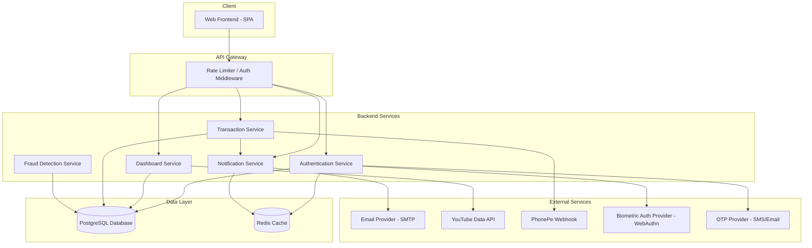
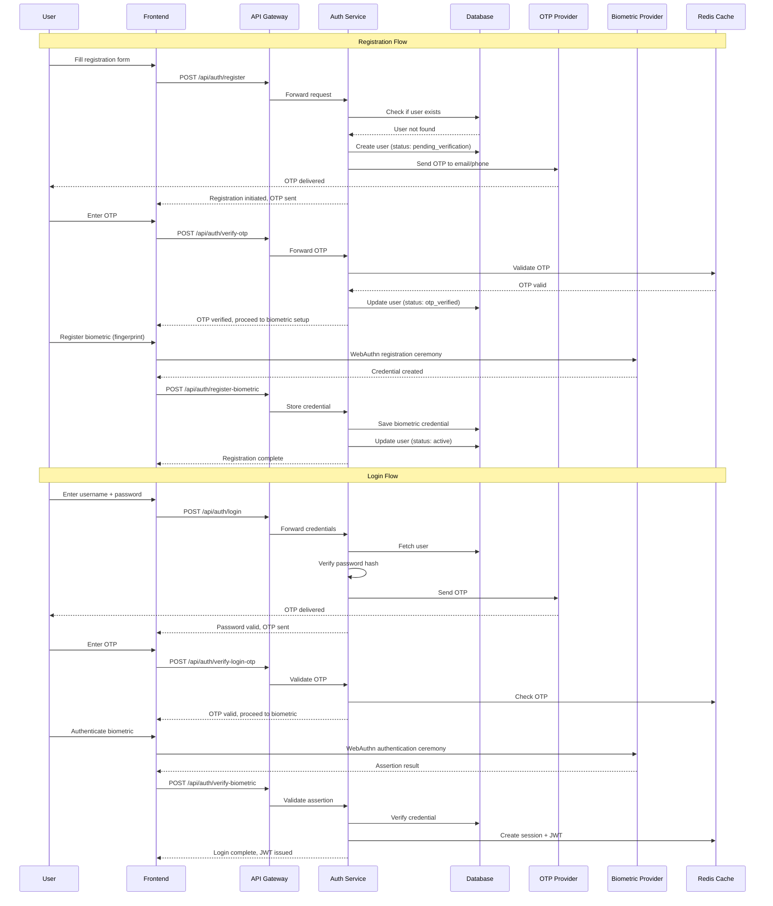
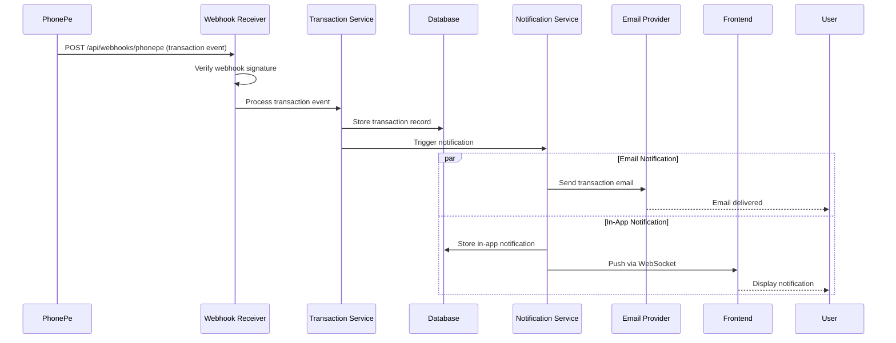
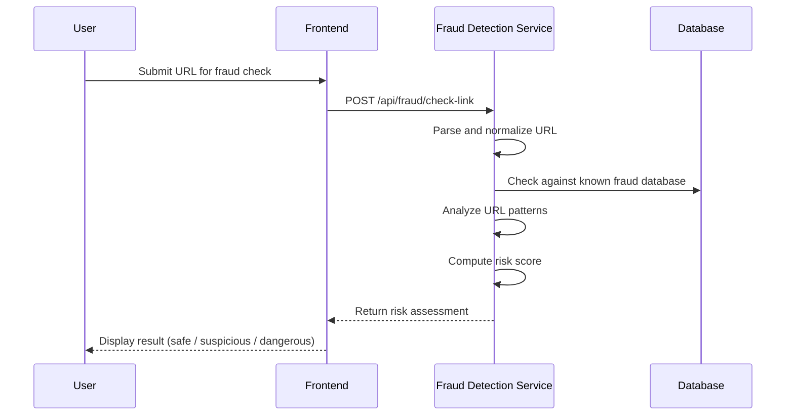

# track1_MasterVibe
# Design Document: Secure Finance App

## Overview

The Secure Finance App is a comprehensive web application designed to enhance financial awareness and provide secure banking utilities. It combines a multi-factor authentication system (password, OTP, and biometric) with a feature-rich dashboard that includes real-time financial awareness content via embedded YouTube programs, transaction tracking with cross-platform notification support (including PhonePe integration), fraud link detection, and an email-based communication layer.

The application follows a layered architecture with a clear separation between the authentication layer, the dashboard/UI layer, the transaction processing layer, and the notification/communication layer. Each layer communicates through well-defined interfaces, ensuring modularity and security. The system prioritizes data encryption at rest and in transit, secure session management, and real-time event-driven notifications.

The target deployment is a web application with a responsive frontend, a backend API server, a relational database for persistent storage, a cache layer for sessions, and integrations with external services (email provider, YouTube Data API, PhonePe webhook receiver, and a biometric authentication provider).

## Architecture

### System Overview



### Authentication Flow



### Transaction and Notification Flow



### Fraud Detection Flow



## Components and Interfaces

### Component 1: Authentication Service

**Purpose**: Manages user registration, login, OTP verification, biometric authentication, and session management.

**Interface**:
```pascal
INTERFACE AuthenticationService
  PROCEDURE register(credentials: RegistrationRequest): AuthResponse
  PROCEDURE verifyOTP(userId: UUID, otp: String): AuthResponse
  PROCEDURE registerBiometric(userId: UUID, credential: BiometricCredential): AuthResponse
  PROCEDURE login(credentials: LoginRequest): AuthResponse
  PROCEDURE verifyLoginOTP(sessionToken: String, otp: String): AuthResponse
  PROCEDURE verifyBiometric(sessionToken: String, assertion: BiometricAssertion): AuthResponse
  PROCEDURE logout(sessionToken: String): Void
  PROCEDURE refreshToken(refreshToken: String): TokenPair
END INTERFACE
```

**Responsibilities**:
- Hash and verify passwords using bcrypt
- Generate, store, and validate time-limited OTPs
- Coordinate WebAuthn registration and authentication ceremonies
- Issue and validate JWT access tokens and refresh tokens
- Manage session lifecycle in Redis cache

### Component 2: Dashboard Service

**Purpose**: Serves dashboard content including YouTube awareness programs, user guides, tutorials, and bank details.

**Interface**:
```pascal
INTERFACE DashboardService
  PROCEDURE getAwarenessPrograms(category: String, page: Integer): PaginatedList OF VideoContent
  PROCEDURE getUserGuide(guideId: UUID): GuideContent
  PROCEDURE getTutorials(category: String, page: Integer): PaginatedList OF TutorialContent
  PROCEDURE getBankDetails(userId: UUID): BankDetails
  PROCEDURE updateBankDetails(userId: UUID, details: BankDetailsUpdate): BankDetails
  PROCEDURE getDashboardSummary(userId: UUID): DashboardSummary
END INTERFACE
```

**Responsibilities**:
- Fetch and cache YouTube video metadata via YouTube Data API
- Serve static and dynamic guide/tutorial content
- Manage user bank details with encryption for sensitive fields
- Aggregate dashboard summary data

### Component 3: Transaction Service

**Purpose**: Processes and tracks transactions from external payment platforms, maintains transaction history.

**Interface**:
```pascal
INTERFACE TransactionService
  PROCEDURE processWebhook(provider: String, payload: WebhookPayload): WebhookResponse
  PROCEDURE getTransactionHistory(userId: UUID, filters: TransactionFilter): PaginatedList OF Transaction
  PROCEDURE getTransactionDetail(userId: UUID, transactionId: UUID): Transaction
  PROCEDURE getTransactionSummary(userId: UUID, period: DateRange): TransactionSummary
END INTERFACE
```

**Responsibilities**:
- Validate and process incoming payment webhooks (PhonePe)
- Store transaction records with full audit trail
- Provide filtered and paginated transaction history
- Trigger notification events for each transaction

### Component 4: Notification Service

**Purpose**: Manages email and in-app notifications for transactions and system events.

**Interface**:
```pascal
INTERFACE NotificationService
  PROCEDURE sendTransactionEmail(userId: UUID, transaction: Transaction): DeliveryStatus
  PROCEDURE sendInAppNotification(userId: UUID, notification: NotificationPayload): DeliveryStatus
  PROCEDURE getNotifications(userId: UUID, filters: NotificationFilter): PaginatedList OF Notification
  PROCEDURE markAsRead(userId: UUID, notificationIds: List OF UUID): Void
  PROCEDURE getUnreadCount(userId: UUID): Integer
END INTERFACE
```

**Responsibilities**:
- Compose and send transactional emails via SMTP provider
- Push real-time in-app notifications via WebSocket
- Store notification history for retrieval
- Track read/unread status

### Component 5: Fraud Detection Service

**Purpose**: Analyzes URLs and links for potential fraud or phishing attempts.

**Interface**:
```pascal
INTERFACE FraudDetectionService
  PROCEDURE checkLink(url: String): FraudCheckResult
  PROCEDURE reportFraudLink(userId: UUID, url: String, reason: String): ReportResult
  PROCEDURE getFraudDatabase(page: Integer): PaginatedList OF FraudEntry
END INTERFACE
```

**Responsibilities**:
- Parse and normalize submitted URLs
- Check URLs against a known fraud/phishing database
- Analyze URL patterns (domain age, suspicious keywords, homoglyph detection)
- Compute and return a risk score with explanation

## Data Models

### Model: User

```pascal
STRUCTURE User
  id: UUID
  email: String
  phone: String
  username: String
  password_hash: String
  status: ENUM (pending_verification, otp_verified, active, suspended, deactivated)
  mfa_enabled: Boolean
  biometric_registered: Boolean
  created_at: Timestamp
  updated_at: Timestamp
END STRUCTURE
```

**Validation Rules**:
- email must be a valid email format and unique
- phone must be a valid phone number format
- username must be 3-50 characters, alphanumeric with underscores
- password must be minimum 8 characters with at least one uppercase, one lowercase, one digit, and one special character
- status transitions follow: pending_verification → otp_verified → active

### Model: BiometricCredential

```pascal
STRUCTURE BiometricCredential
  id: UUID
  user_id: UUID (FK → User.id)
  credential_id: String
  public_key: Binary
  sign_count: Integer
  device_name: String
  created_at: Timestamp
  last_used_at: Timestamp
END STRUCTURE
```

**Validation Rules**:
- credential_id must be unique per user
- public_key must be a valid COSE key
- sign_count must be monotonically increasing (replay protection)

### Model: Transaction

```pascal
STRUCTURE Transaction
  id: UUID
  user_id: UUID (FK → User.id)
  external_transaction_id: String
  provider: ENUM (phonepe, bank_transfer, upi, other)
  type: ENUM (credit, debit)
  amount: Decimal(12,2)
  currency: String (ISO 4217)
  status: ENUM (pending, completed, failed, refunded)
  merchant_name: String
  description: String
  metadata: JSON
  created_at: Timestamp
  updated_at: Timestamp
END STRUCTURE
```

**Validation Rules**:
- amount must be positive
- currency must be a valid ISO 4217 code
- external_transaction_id must be unique per provider
- status transitions: pending → completed | failed; completed → refunded

### Model: Notification

```pascal
STRUCTURE Notification
  id: UUID
  user_id: UUID (FK → User.id)
  type: ENUM (transaction, security, system, fraud_alert)
  channel: ENUM (email, in_app, both)
  title: String
  body: String
  metadata: JSON
  is_read: Boolean
  email_sent: Boolean
  email_sent_at: Timestamp
  created_at: Timestamp
END STRUCTURE
```

**Validation Rules**:
- title must be non-empty, max 200 characters
- body must be non-empty, max 5000 characters
- is_read defaults to false

### Model: FraudEntry

```pascal
STRUCTURE FraudEntry
  id: UUID
  url: String
  domain: String
  risk_score: Decimal(3,2)
  category: ENUM (phishing, malware, scam, suspicious, safe)
  reported_by: UUID (FK → User.id, nullable)
  verified: Boolean
  created_at: Timestamp
  updated_at: Timestamp
END STRUCTURE
```

**Validation Rules**:
- url must be a valid URL format
- risk_score must be between 0.00 and 1.00
- domain is extracted and normalized from url

### Model: BankDetails

```pascal
STRUCTURE BankDetails
  id: UUID
  user_id: UUID (FK → User.id)
  bank_name: String
  account_number_encrypted: Binary
  ifsc_code: String
  account_type: ENUM (savings, current, salary)
  is_primary: Boolean
  created_at: Timestamp
  updated_at: Timestamp
END STRUCTURE
```

**Validation Rules**:
- account_number is stored encrypted (AES-256)
- ifsc_code must match pattern: 4 letters + 0 + 6 alphanumeric characters
- Only one bank detail per user can have is_primary = true


## Algorithmic Pseudocode

### Algorithm 1: User Registration

```pascal
ALGORITHM registerUser(request)
INPUT: request of type RegistrationRequest (email, phone, username, password)
OUTPUT: result of type AuthResponse

BEGIN
  ASSERT request.email IS NOT NULL AND isValidEmail(request.email)
  ASSERT request.password IS NOT NULL AND meetsPasswordPolicy(request.password)
  ASSERT request.username IS NOT NULL AND LENGTH(request.username) >= 3

  // Step 1: Check for existing user
  existingUser ← database.findUserByEmail(request.email)

  IF existingUser IS NOT NULL THEN
    RETURN AuthResponse(success: false, error: "Email already registered")
  END IF

  existingUsername ← database.findUserByUsername(request.username)

  IF existingUsername IS NOT NULL THEN
    RETURN AuthResponse(success: false, error: "Username already taken")
  END IF

  // Step 2: Hash password
  salt ← generateRandomSalt(16)
  passwordHash ← bcryptHash(request.password, salt, costFactor: 12)

  // Step 3: Create user record
  user ← NEW User
  user.id ← generateUUID()
  user.email ← request.email
  user.phone ← request.phone
  user.username ← request.username
  user.password_hash ← passwordHash
  user.status ← "pending_verification"
  user.mfa_enabled ← true
  user.biometric_registered ← false
  user.created_at ← NOW()

  database.saveUser(user)

  // Step 4: Generate and send OTP
  otp ← generateSecureOTP(length: 6)
  otpExpiry ← NOW() + 5 MINUTES
  cache.store("otp:" + user.id, otp, ttl: 300)
  cache.store("otp_attempts:" + user.id, 0, ttl: 300)

  otpProvider.sendOTP(user.email, user.phone, otp)

  RETURN AuthResponse(success: true, userId: user.id, message: "OTP sent")
END
```

**Preconditions:**
- `request` contains non-null email, phone, username, and password
- `request.email` is a valid email format
- `request.password` meets the password policy (min 8 chars, mixed case, digit, special char)
- Database connection is available

**Postconditions:**
- If successful: a new User record exists in the database with status `pending_verification`
- If successful: an OTP is stored in cache with 5-minute TTL
- If successful: OTP is sent to user's email and phone
- If email exists: no new record is created, error returned
- Password is never stored in plaintext

**Loop Invariants:** N/A

---

### Algorithm 2: OTP Verification

```pascal
ALGORITHM verifyOTP(userId, submittedOTP)
INPUT: userId of type UUID, submittedOTP of type String
OUTPUT: result of type AuthResponse

BEGIN
  ASSERT userId IS NOT NULL
  ASSERT submittedOTP IS NOT NULL AND LENGTH(submittedOTP) = 6

  // Step 1: Rate limit check
  attempts ← cache.get("otp_attempts:" + userId)

  IF attempts IS NULL THEN
    RETURN AuthResponse(success: false, error: "OTP expired, request a new one")
  END IF

  IF attempts >= 5 THEN
    cache.delete("otp:" + userId)
    cache.delete("otp_attempts:" + userId)
    RETURN AuthResponse(success: false, error: "Too many attempts, OTP invalidated")
  END IF

  // Step 2: Retrieve and validate OTP
  storedOTP ← cache.get("otp:" + userId)

  IF storedOTP IS NULL THEN
    RETURN AuthResponse(success: false, error: "OTP expired")
  END IF

  // Step 3: Constant-time comparison to prevent timing attacks
  IF NOT constantTimeEquals(submittedOTP, storedOTP) THEN
    cache.increment("otp_attempts:" + userId)
    RETURN AuthResponse(success: false, error: "Invalid OTP")
  END IF

  // Step 4: OTP valid - clean up and update user
  cache.delete("otp:" + userId)
  cache.delete("otp_attempts:" + userId)

  user ← database.findUserById(userId)
  user.status ← "otp_verified"
  user.updated_at ← NOW()
  database.updateUser(user)

  RETURN AuthResponse(success: true, userId: userId, message: "OTP verified")
END
```

**Preconditions:**
- `userId` corresponds to an existing user with status `pending_verification` (registration) or a valid login session
- `submittedOTP` is a 6-character string
- Cache service is available

**Postconditions:**
- If valid: OTP entries are removed from cache, user status updated to `otp_verified`
- If invalid: attempt counter is incremented
- If max attempts exceeded: OTP is invalidated entirely
- Comparison is constant-time (no timing side-channel)

**Loop Invariants:** N/A

---

### Algorithm 3: Biometric Registration (WebAuthn)

```pascal
ALGORITHM registerBiometric(userId, credential)
INPUT: userId of type UUID, credential of type BiometricCredential
OUTPUT: result of type AuthResponse

BEGIN
  ASSERT userId IS NOT NULL
  ASSERT credential IS NOT NULL
  ASSERT credential.credential_id IS NOT NULL
  ASSERT credential.public_key IS NOT NULL

  // Step 1: Verify user is in correct state
  user ← database.findUserById(userId)

  IF user IS NULL THEN
    RETURN AuthResponse(success: false, error: "User not found")
  END IF

  IF user.status <> "otp_verified" THEN
    RETURN AuthResponse(success: false, error: "Complete OTP verification first")
  END IF

  // Step 2: Verify the WebAuthn attestation
  challenge ← cache.get("webauthn_challenge:" + userId)

  IF challenge IS NULL THEN
    RETURN AuthResponse(success: false, error: "Registration challenge expired")
  END IF

  attestationValid ← webauthn.verifyAttestation(credential, challenge)

  IF NOT attestationValid THEN
    RETURN AuthResponse(success: false, error: "Biometric verification failed")
  END IF

  // Step 3: Store credential
  bioCredential ← NEW BiometricCredential
  bioCredential.id ← generateUUID()
  bioCredential.user_id ← userId
  bioCredential.credential_id ← credential.credential_id
  bioCredential.public_key ← credential.public_key
  bioCredential.sign_count ← 0
  bioCredential.device_name ← credential.device_name
  bioCredential.created_at ← NOW()

  database.saveBiometricCredential(bioCredential)

  // Step 4: Activate user
  user.status ← "active"
  user.biometric_registered ← true
  user.updated_at ← NOW()
  database.updateUser(user)

  cache.delete("webauthn_challenge:" + userId)

  RETURN AuthResponse(success: true, userId: userId, message: "Registration complete")
END
```

**Preconditions:**
- User exists and has status `otp_verified`
- A valid WebAuthn challenge exists in cache for this user
- Credential contains valid attestation data

**Postconditions:**
- If successful: BiometricCredential record stored in database
- If successful: User status updated to `active`, biometric_registered set to true
- Challenge is consumed (deleted from cache) regardless of outcome
- sign_count initialized to 0

**Loop Invariants:** N/A

---

### Algorithm 4: Multi-Factor Login

```pascal
ALGORITHM loginUser(request)
INPUT: request of type LoginRequest (email, password)
OUTPUT: result of type AuthResponse

BEGIN
  ASSERT request.email IS NOT NULL
  ASSERT request.password IS NOT NULL

  // Step 1: Rate limiting
  loginAttempts ← cache.get("login_attempts:" + request.email)

  IF loginAttempts IS NOT NULL AND loginAttempts >= 10 THEN
    RETURN AuthResponse(success: false, error: "Account temporarily locked, try again later")
  END IF

  // Step 2: Find user
  user ← database.findUserByEmail(request.email)

  IF user IS NULL THEN
    // Constant-time delay to prevent user enumeration
    bcryptHash("dummy_password", generateRandomSalt(16), costFactor: 12)
    cache.increment("login_attempts:" + request.email)
    RETURN AuthResponse(success: false, error: "Invalid credentials")
  END IF

  IF user.status <> "active" THEN
    RETURN AuthResponse(success: false, error: "Account is not active")
  END IF

  // Step 3: Verify password
  passwordValid ← bcryptVerify(request.password, user.password_hash)

  IF NOT passwordValid THEN
    cache.increment("login_attempts:" + request.email)
    RETURN AuthResponse(success: false, error: "Invalid credentials")
  END IF

  // Step 4: Password valid - initiate MFA
  sessionToken ← generateSecureToken(32)
  cache.store("mfa_session:" + sessionToken, user.id, ttl: 600)

  // Step 5: Send OTP for second factor
  otp ← generateSecureOTP(length: 6)
  cache.store("login_otp:" + sessionToken, otp, ttl: 300)
  cache.store("login_otp_attempts:" + sessionToken, 0, ttl: 300)

  otpProvider.sendOTP(user.email, user.phone, otp)

  RETURN AuthResponse(success: true, sessionToken: sessionToken, message: "OTP sent", step: "otp_verification")
END
```

**Preconditions:**
- `request` contains non-null email and password
- Database and cache services are available

**Postconditions:**
- If credentials valid: MFA session created in cache with 10-minute TTL, OTP sent
- If credentials invalid: login attempt counter incremented
- If account locked: no authentication attempted
- Timing is constant regardless of whether user exists (prevents enumeration)
- Password is never logged or stored in session

**Loop Invariants:** N/A

---

### Algorithm 5: Process PhonePe Webhook

```pascal
ALGORITHM processPhonePeWebhook(payload, signature)
INPUT: payload of type WebhookPayload, signature of type String
OUTPUT: result of type WebhookResponse

BEGIN
  ASSERT payload IS NOT NULL
  ASSERT signature IS NOT NULL

  // Step 1: Verify webhook signature
  expectedSignature ← hmacSHA256(serialize(payload), PHONEPE_WEBHOOK_SECRET)

  IF NOT constantTimeEquals(signature, expectedSignature) THEN
    logSecurityEvent("Invalid webhook signature", payload)
    RETURN WebhookResponse(status: 401, message: "Invalid signature")
  END IF

  // Step 2: Idempotency check
  existingTxn ← database.findTransactionByExternalId("phonepe", payload.transactionId)

  IF existingTxn IS NOT NULL THEN
    RETURN WebhookResponse(status: 200, message: "Already processed")
  END IF

  // Step 3: Identify user
  user ← database.findUserByPhonePeId(payload.merchantUserId)

  IF user IS NULL THEN
    logWarning("Unknown user for PhonePe transaction", payload.merchantUserId)
    RETURN WebhookResponse(status: 200, message: "User not found, acknowledged")
  END IF

  // Step 4: Create transaction record
  transaction ← NEW Transaction
  transaction.id ← generateUUID()
  transaction.user_id ← user.id
  transaction.external_transaction_id ← payload.transactionId
  transaction.provider ← "phonepe"
  transaction.type ← mapTransactionType(payload.type)
  transaction.amount ← payload.amount / 100  // PhonePe sends amount in paise
  transaction.currency ← "INR"
  transaction.status ← mapTransactionStatus(payload.status)
  transaction.merchant_name ← payload.merchantName
  transaction.description ← payload.description
  transaction.metadata ← payload.rawData
  transaction.created_at ← NOW()

  database.saveTransaction(transaction)

  // Step 5: Trigger notifications
  notificationService.sendTransactionEmail(user.id, transaction)
  notificationService.sendInAppNotification(user.id, NEW NotificationPayload(
    type: "transaction",
    title: "Transaction " + transaction.status,
    body: formatTransactionMessage(transaction)
  ))

  RETURN WebhookResponse(status: 200, message: "Processed")
END
```

**Preconditions:**
- `payload` is a valid PhonePe webhook payload
- `signature` is the HMAC signature from the webhook header
- PHONEPE_WEBHOOK_SECRET is configured

**Postconditions:**
- If signature invalid: request rejected with 401, security event logged
- If duplicate: acknowledged with 200, no new record created (idempotent)
- If valid and new: Transaction record created, email and in-app notifications triggered
- Amount is converted from paise to rupees (divided by 100)
- Webhook always returns 200 for valid signatures (even if user not found) to prevent retries

**Loop Invariants:** N/A

---

### Algorithm 6: Fraud Link Detection

```pascal
ALGORITHM checkLinkForFraud(url)
INPUT: url of type String
OUTPUT: result of type FraudCheckResult

BEGIN
  ASSERT url IS NOT NULL AND isValidURL(url)

  // Step 1: Normalize URL
  normalizedURL ← normalizeURL(url)
  domain ← extractDomain(normalizedURL)

  // Step 2: Check against known fraud database
  knownEntry ← database.findFraudEntryByDomain(domain)

  IF knownEntry IS NOT NULL AND knownEntry.verified = true THEN
    RETURN FraudCheckResult(
      url: normalizedURL,
      risk_score: knownEntry.risk_score,
      category: knownEntry.category,
      reasons: ["Known " + knownEntry.category + " domain"],
      recommendation: getRecommendation(knownEntry.category)
    )
  END IF

  // Step 3: Heuristic analysis
  riskFactors ← EMPTY LIST
  riskScore ← 0.0

  // Check 3a: Domain age
  domainAge ← lookupDomainAge(domain)
  IF domainAge < 30 DAYS THEN
    riskScore ← riskScore + 0.3
    ADD "Domain registered less than 30 days ago" TO riskFactors
  END IF

  // Check 3b: Homoglyph detection (lookalike characters)
  FOR each knownBank IN KNOWN_BANK_DOMAINS DO
    similarity ← computeLevenshteinDistance(domain, knownBank)
    IF similarity <= 2 AND domain <> knownBank THEN
      riskScore ← riskScore + 0.4
      ADD "Domain similar to known bank: " + knownBank TO riskFactors
    END IF
  END FOR

  // Check 3c: Suspicious URL patterns
  suspiciousPatterns ← ["login", "verify", "secure", "update", "confirm", "account"]
  matchCount ← 0
  FOR each pattern IN suspiciousPatterns DO
    IF normalizedURL CONTAINS pattern THEN
      matchCount ← matchCount + 1
    END IF
  END FOR

  IF matchCount >= 3 THEN
    riskScore ← riskScore + 0.2
    ADD "URL contains multiple suspicious keywords" TO riskFactors
  END IF

  // Check 3d: HTTPS check
  IF NOT normalizedURL STARTS WITH "https://" THEN
    riskScore ← riskScore + 0.1
    ADD "URL does not use HTTPS" TO riskFactors
  END IF

  // Step 4: Cap risk score and determine category
  riskScore ← MIN(riskScore, 1.0)
  category ← categorizeRisk(riskScore)

  RETURN FraudCheckResult(
    url: normalizedURL,
    risk_score: riskScore,
    category: category,
    reasons: riskFactors,
    recommendation: getRecommendation(category)
  )
END

PROCEDURE categorizeRisk(score)
  IF score >= 0.8 THEN RETURN "phishing"
  ELSE IF score >= 0.5 THEN RETURN "suspicious"
  ELSE IF score >= 0.3 THEN RETURN "suspicious"
  ELSE RETURN "safe"
  END IF
END PROCEDURE

PROCEDURE getRecommendation(category)
  IF category = "phishing" OR category = "malware" THEN
    RETURN "Do NOT click this link. It has been identified as dangerous."
  ELSE IF category = "scam" OR category = "suspicious" THEN
    RETURN "Exercise caution. This link shows suspicious characteristics."
  ELSE
    RETURN "This link appears safe, but always verify the source."
  END IF
END PROCEDURE
```

**Preconditions:**
- `url` is a non-null, valid URL string
- Known fraud database is accessible
- Domain lookup service is available

**Postconditions:**
- Returns a FraudCheckResult with risk_score between 0.00 and 1.00
- Category is one of: phishing, malware, scam, suspicious, safe
- reasons list contains human-readable explanations for the score
- Known verified entries return immediately without heuristic analysis

**Loop Invariants:**
- In the homoglyph detection loop: riskScore is non-negative and all previously checked domains have been evaluated
- In the suspicious patterns loop: matchCount accurately reflects the number of patterns found so far


## Key Functions with Formal Specifications

### Function: generateSecureOTP()

```pascal
PROCEDURE generateSecureOTP(length)
  INPUT: length of type Integer
  OUTPUT: otp of type String
```

**Preconditions:**
- `length` is a positive integer between 4 and 8
- Cryptographically secure random number generator is available

**Postconditions:**
- Returns a string of exactly `length` digits
- Each digit is independently and uniformly distributed (0-9)
- OTP is generated using cryptographic randomness (not pseudo-random)

---

### Function: constantTimeEquals()

```pascal
PROCEDURE constantTimeEquals(a, b)
  INPUT: a of type String, b of type String
  OUTPUT: equal of type Boolean
```

**Preconditions:**
- Both `a` and `b` are non-null strings

**Postconditions:**
- Returns true if and only if `a` and `b` are identical character-by-character
- Execution time is constant regardless of where strings differ (prevents timing attacks)
- No early termination on first mismatch

---

### Function: normalizeURL()

```pascal
PROCEDURE normalizeURL(url)
  INPUT: url of type String
  OUTPUT: normalized of type String
```

**Preconditions:**
- `url` is a non-null string that passes basic URL format validation

**Postconditions:**
- Scheme is lowercased (HTTP → http)
- Domain is lowercased
- Trailing slashes are removed
- Query parameters are sorted alphabetically
- Fragment identifiers are removed
- Percent-encoding is normalized

---

### Function: formatTransactionMessage()

```pascal
PROCEDURE formatTransactionMessage(transaction)
  INPUT: transaction of type Transaction
  OUTPUT: message of type String
```

**Preconditions:**
- `transaction` is a valid, non-null Transaction record
- `transaction.amount` is a positive decimal

**Postconditions:**
- Returns a human-readable message describing the transaction
- Includes: type (credit/debit), amount with currency symbol, merchant name, status
- Amount is formatted with proper decimal places and currency symbol
- No sensitive data (account numbers) included in message

## Example Usage

### Example 1: Complete Registration Flow

```pascal
SEQUENCE
  // User fills registration form
  request ← NEW RegistrationRequest
  request.email ← "user@example.com"
  request.phone ← "+919876543210"
  request.username ← "john_doe"
  request.password ← "SecureP@ss123"

  // Step 1: Register
  result ← authService.register(request)
  ASSERT result.success = true
  DISPLAY "OTP sent to your email and phone"

  // Step 2: Verify OTP
  otp ← User_Input("Enter the 6-digit OTP")
  otpResult ← authService.verifyOTP(result.userId, otp)
  ASSERT otpResult.success = true
  DISPLAY "OTP verified, set up fingerprint"

  // Step 3: Register biometric
  credential ← webauthn.createCredential(result.userId)
  bioResult ← authService.registerBiometric(result.userId, credential)
  ASSERT bioResult.success = true
  DISPLAY "Registration complete! You can now log in."
END SEQUENCE
```

### Example 2: Login with MFA

```pascal
SEQUENCE
  // Step 1: Password
  loginRequest ← NEW LoginRequest
  loginRequest.email ← "user@example.com"
  loginRequest.password ← "SecureP@ss123"

  loginResult ← authService.login(loginRequest)
  ASSERT loginResult.success = true AND loginResult.step = "otp_verification"

  // Step 2: OTP
  otp ← User_Input("Enter OTP")
  otpResult ← authService.verifyLoginOTP(loginResult.sessionToken, otp)
  ASSERT otpResult.success = true AND otpResult.step = "biometric_verification"

  // Step 3: Biometric
  assertion ← webauthn.getAssertion(loginResult.sessionToken)
  bioResult ← authService.verifyBiometric(loginResult.sessionToken, assertion)
  ASSERT bioResult.success = true

  jwt ← bioResult.accessToken
  DISPLAY "Login successful, redirecting to dashboard"
END SEQUENCE
```

### Example 3: Fraud Link Check

```pascal
SEQUENCE
  suspiciousURL ← "http://sbi-secure-login.xyz/verify-account"

  result ← fraudService.checkLink(suspiciousURL)

  DISPLAY "Risk Score: " + result.risk_score
  DISPLAY "Category: " + result.category

  FOR each reason IN result.reasons DO
    DISPLAY "  - " + reason
  END FOR

  DISPLAY "Recommendation: " + result.recommendation

  // Expected output:
  // Risk Score: 0.80
  // Category: phishing
  //   - Domain registered less than 30 days ago
  //   - Domain similar to known bank: sbi.co.in
  //   - URL contains multiple suspicious keywords
  //   - URL does not use HTTPS
  // Recommendation: Do NOT click this link. It has been identified as dangerous.
END SEQUENCE
```

### Example 4: Transaction Notification Flow

```pascal
SEQUENCE
  // PhonePe sends webhook
  webhookPayload ← NEW WebhookPayload
  webhookPayload.transactionId ← "PP_TXN_123456"
  webhookPayload.merchantUserId ← "user_abc"
  webhookPayload.type ← "DEBIT"
  webhookPayload.amount ← 150000  // 1500.00 INR in paise
  webhookPayload.status ← "SUCCESS"
  webhookPayload.merchantName ← "Amazon India"

  result ← transactionService.processWebhook("phonepe", webhookPayload)
  ASSERT result.status = 200

  // User receives:
  // 1. Email: "Transaction Alert: ₹1,500.00 debited to Amazon India"
  // 2. In-app notification pushed via WebSocket
  // 3. Transaction visible in transaction history
END SEQUENCE
```

## Correctness Properties

### Property 1: Password Security
```pascal
// Passwords are never stored or transmitted in plaintext
FOR ALL users u IN database.users:
  ASSERT u.password_hash <> u.original_password
  ASSERT bcryptVerify(u.original_password, u.password_hash) = true
  ASSERT NOT EXISTS log IN system.logs WHERE log CONTAINS u.original_password
```

### Property 2: OTP Validity
```pascal
// OTPs expire after 5 minutes and are single-use
FOR ALL otps o IN cache WHERE key STARTS WITH "otp:":
  ASSERT o.ttl <= 300 seconds
  ASSERT after successful verification: cache.get(o.key) = NULL
```

### Property 3: Idempotent Webhook Processing
```pascal
// Processing the same webhook twice produces the same result without duplicates
FOR ALL webhooks w1, w2 WHERE w1.transactionId = w2.transactionId:
  result1 ← processWebhook(w1)
  result2 ← processWebhook(w2)
  ASSERT result1.status = 200 AND result2.status = 200
  ASSERT COUNT(transactions WHERE external_id = w1.transactionId) = 1
```

### Property 4: Transaction Notification Completeness
```pascal
// Every completed transaction generates both email and in-app notification
FOR ALL transactions t WHERE t.status = "completed":
  ASSERT EXISTS notification n1 WHERE n1.user_id = t.user_id
    AND n1.type = "transaction" AND n1.channel IN ("email", "both")
  ASSERT EXISTS notification n2 WHERE n2.user_id = t.user_id
    AND n2.type = "transaction" AND n2.channel IN ("in_app", "both")
```

### Property 5: Fraud Score Bounds
```pascal
// Risk scores are always within valid range
FOR ALL fraud checks fc:
  ASSERT fc.risk_score >= 0.00 AND fc.risk_score <= 1.00
  ASSERT fc.category IN ("phishing", "malware", "scam", "suspicious", "safe")
  ASSERT (fc.risk_score >= 0.8) IMPLIES (fc.category IN ("phishing", "malware"))
  ASSERT (fc.risk_score < 0.3) IMPLIES (fc.category = "safe")
```

### Property 6: Authentication State Machine
```pascal
// User status transitions follow the defined state machine
FOR ALL users u:
  ASSERT u.status IN ("pending_verification", "otp_verified", "active", "suspended", "deactivated")
  // Valid transitions only
  IF u.previous_status = "pending_verification" THEN
    ASSERT u.status IN ("pending_verification", "otp_verified")
  END IF
  IF u.previous_status = "otp_verified" THEN
    ASSERT u.status IN ("otp_verified", "active")
  END IF
  IF u.previous_status = "active" THEN
    ASSERT u.status IN ("active", "suspended", "deactivated")
  END IF
```

### Property 7: Biometric Replay Protection
```pascal
// Sign count must be monotonically increasing to prevent credential cloning
FOR ALL biometric authentications ba ON credential c:
  ASSERT ba.new_sign_count > c.sign_count
  // After update:
  ASSERT c.sign_count = ba.new_sign_count
```

### Property 8: Constant-Time Comparison
```pascal
// Timing of comparison does not leak information about input
FOR ALL string pairs (a, b) WHERE LENGTH(a) = LENGTH(b):
  time1 ← measure(constantTimeEquals(a, b)) WHERE a = b
  time2 ← measure(constantTimeEquals(a, b)) WHERE a <> b at position 0
  time3 ← measure(constantTimeEquals(a, b)) WHERE a <> b at position LENGTH(a)-1
  ASSERT |time1 - time2| < EPSILON
  ASSERT |time1 - time3| < EPSILON
```

## Error Handling

### Error Scenario 1: OTP Expiration

**Condition**: User does not enter OTP within 5 minutes of generation
**Response**: Return error "OTP expired, request a new one" with HTTP 400
**Recovery**: User can request a new OTP via the resend endpoint (rate-limited to 3 resends per 15 minutes)

### Error Scenario 2: Account Lockout

**Condition**: 10 failed login attempts within 30 minutes
**Response**: Return error "Account temporarily locked" with HTTP 429
**Recovery**: Account automatically unlocks after 30 minutes. User can also reset via email verification flow.

### Error Scenario 3: Invalid Webhook Signature

**Condition**: PhonePe webhook arrives with invalid HMAC signature
**Response**: Return HTTP 401, log security event with full payload for investigation
**Recovery**: No retry needed. Security team reviews logged events. Legitimate webhooks will be retried by PhonePe.

### Error Scenario 4: Biometric Authentication Failure

**Condition**: WebAuthn assertion verification fails (wrong device, tampered credential)
**Response**: Return error "Biometric verification failed" with HTTP 401
**Recovery**: User can retry biometric authentication up to 3 times, then falls back to password + OTP only login with admin notification.

### Error Scenario 5: Database Connection Failure

**Condition**: Database becomes unreachable during a request
**Response**: Return HTTP 503 "Service temporarily unavailable"
**Recovery**: Application uses connection pooling with automatic reconnection. Circuit breaker pattern prevents cascading failures. Health check endpoint monitors database connectivity.

### Error Scenario 6: External Service Timeout

**Condition**: YouTube API, email provider, or OTP provider times out
**Response**: Return partial success where possible (e.g., dashboard loads without videos)
**Recovery**: Retry with exponential backoff (max 3 retries). Cache previous successful responses for graceful degradation. Alert operations team if failure rate exceeds threshold.

## Testing Strategy

### Unit Testing Approach

- Test each service method in isolation with mocked dependencies
- Key test cases:
  - Registration with valid/invalid inputs
  - OTP generation randomness and format
  - Password hashing and verification
  - Fraud score calculation with various URL patterns
  - Transaction amount conversion (paise to rupees)
  - Notification message formatting
- Coverage goal: 90% line coverage for all service modules

### Property-Based Testing Approach

**Property Test Library**: fast-check (JavaScript/TypeScript) or Hypothesis (Python)

- Password hashing: for any password, hash is always different from plaintext and verify always succeeds
- OTP generation: for any length 4-8, output is always exactly that many digits
- Fraud score: for any URL input, score is always in [0.0, 1.0] range
- URL normalization: normalizing a normalized URL returns the same URL (idempotent)
- Webhook processing: processing same webhook twice never creates duplicate transactions
- Transaction amount: conversion from paise to rupees preserves value (amount_paise / 100 = amount_rupees)

### Integration Testing Approach

- Test complete authentication flow (register → OTP → biometric → login)
- Test webhook receipt → transaction creation → notification delivery pipeline
- Test fraud detection with known phishing URLs and safe URLs
- Test dashboard data aggregation with real YouTube API responses (sandboxed)
- Use test containers for PostgreSQL and Redis in CI/CD pipeline

## Performance Considerations

- **Session Management**: Redis cache for sessions and OTPs with appropriate TTLs to prevent memory bloat
- **Database Indexing**: Indexes on User.email, User.username, Transaction.user_id, Transaction.external_transaction_id, FraudEntry.domain
- **Webhook Processing**: Async processing with message queue for notification delivery to prevent webhook timeout
- **YouTube API**: Cache video metadata for 1 hour to reduce API calls and improve dashboard load time
- **Connection Pooling**: Database connection pool (min: 5, max: 20) to handle concurrent requests
- **Rate Limiting**: Per-endpoint rate limits to prevent abuse (login: 10/min, OTP resend: 3/15min, fraud check: 30/min)
- **WebSocket**: Use WebSocket for real-time in-app notifications instead of polling

## Security Considerations

- **Password Storage**: bcrypt with cost factor 12, never store or log plaintext passwords
- **Data Encryption**: AES-256 encryption for sensitive fields (bank account numbers) at rest
- **Transport Security**: TLS 1.2+ for all communications, HSTS headers enabled
- **CSRF Protection**: Anti-CSRF tokens for all state-changing requests
- **XSS Prevention**: Content Security Policy headers, input sanitization, output encoding
- **SQL Injection**: Parameterized queries for all database operations
- **Webhook Security**: HMAC signature verification for all incoming webhooks
- **Session Security**: HTTP-only, Secure, SameSite cookies for session tokens; JWT with short expiry (15 min access, 7 day refresh)
- **Biometric Security**: WebAuthn standard with attestation verification, sign count validation for clone detection
- **Timing Attacks**: Constant-time comparison for all secret comparisons (OTP, signatures, passwords)
- **User Enumeration**: Consistent response times and messages for login failures regardless of whether user exists
- **Input Validation**: Strict validation on all API inputs with allowlists where possible

## Dependencies

| Dependency | Purpose | Category |
|---|---|---|
| PostgreSQL 15+ | Primary relational database | Data Storage |
| Redis 7+ | Session cache, OTP storage, rate limiting | Caching |
| bcrypt | Password hashing | Security |
| WebAuthn/FIDO2 library | Biometric authentication | Authentication |
| SMTP provider (e.g., SendGrid) | Transactional email delivery | Communication |
| YouTube Data API v3 | Financial awareness video content | Content |
| WebSocket library | Real-time in-app notifications | Communication |
| HMAC-SHA256 | Webhook signature verification | Security |
| JWT library | Access and refresh token management | Authentication |
| Mermaid | Diagram rendering (documentation) | Documentation |
