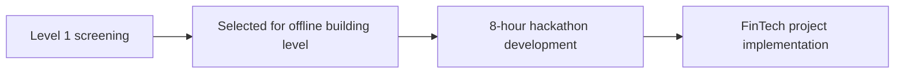
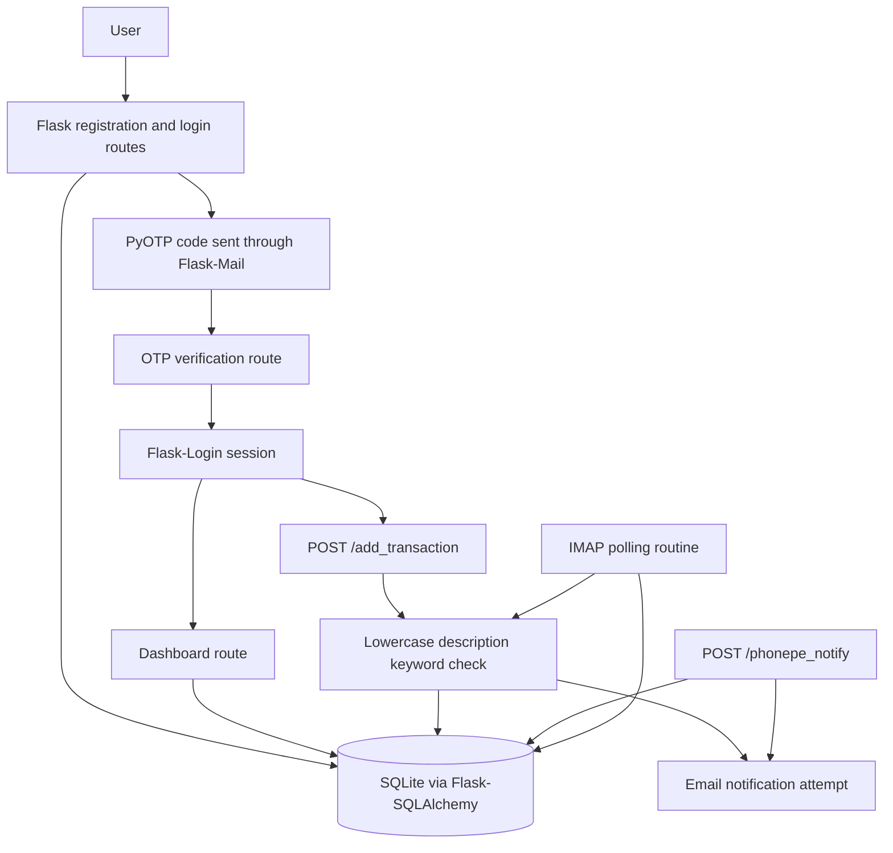
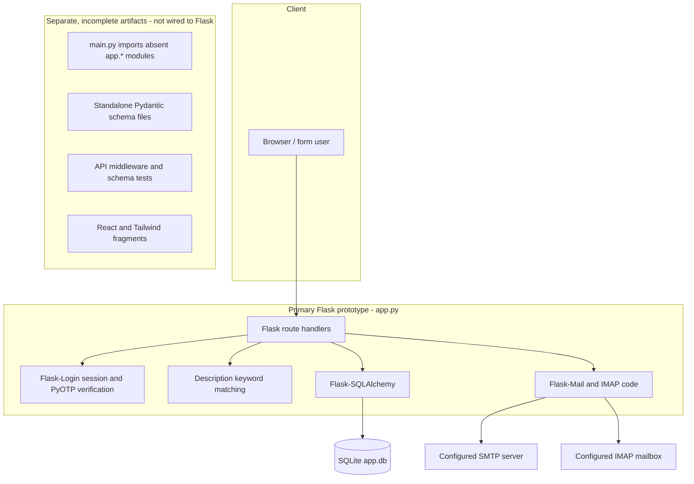
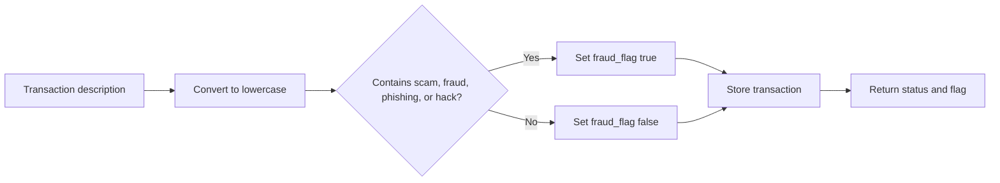

# FinSignal - FinTech Transaction Monitoring Prototype

**A hackathon prototype for recording transactions, flagging descriptions that contain selected suspicious terms, and sending email notifications.**


## Hackathon Information

| Attribute | Details |
|---|---|
| Hackathon | Vibeathon by Mind Mesh |
| Project | FinSignal |
| Team | MasterVibe |
| Track | Track 1 |
| Domain | FinTech |
| Venue | Vidyavardhaka College of Engineering, Mysore |
| Build duration | 8 Hours |
| GitHub organization | VectorFlow-vvce |

## Team Members

| Team Member |
|---|
| Nisarga NS |
| Neha Anjum |
| Neha BP |
| Nikhitha |

## Hackathon Journey



## Development Status

> "I will verify and develop full working protocol"

The repository contains prototype code and additional partial artifacts. It does not include a complete, reproducibly installable application package.

## Contents

- [Project Overview](#project-overview)
- [Problem Statement](#problem-statement)
- [Objectives](#objectives)
- [Key Features](#key-features)
- [End-to-End Workflow](#end-to-end-workflow)
- [System Architecture](#system-architecture)
- [Technology Stack](#technology-stack)
- [Project Structure](#project-structure)
- [Authentication and Security](#authentication-and-security)
- [Fraud Detection Workflow](#fraud-detection-workflow)
- [Database and Data Flow](#database-and-data-flow)
- [Installation and Setup](#installation-and-setup)
- [Running the Application](#running-the-application)
- [API Overview](#api-overview)
- [Screenshots and Demo](#screenshots-and-demo)
- [Hackathon Build Context](#hackathon-build-context)
- [Limitations](#limitations)
- [Future Enhancements](#future-enhancements)
- [Team](#team)
- [License](#license)

## Project Overview

FinSignal is a small financial transaction-monitoring prototype. Its primary backend is a Flask application that defines user registration and login, email-delivered time-based one-time passwords (TOTP), a transaction history backed by SQLite through Flask-SQLAlchemy, and a simple description-based fraud flag.

An authenticated user can record a transaction with an amount and description. The backend checks the description for a short set of suspicious keywords, stores a boolean flag with the transaction, and attempts to email an alert. A separate PhonePe-labelled endpoint accepts transaction details and sends an email notification; the code does not implement a verified PhonePe integration. An IMAP polling routine is also present in the Flask source.

The code is relevant to FinTech as an early demonstration of transaction logging and basic risk flagging. The decision is a keyword match, not a trained fraud model or a comprehensive financial risk assessment. The intended user represented by the code is an account holder reviewing their own recorded transactions.

The repository also contains Pydantic schema modules, tests for a proposed API/middleware package, a FastAPI entry point that imports modules not present in this checkout, and React/Tailwind UI fragments. These artifacts are not wired into the Flask application and should not be read as a functioning second application or as proof of the API and security capabilities described in the earlier design document.

## Problem Statement

The implemented problem is limited to recording transaction details and highlighting descriptions containing one of four configured terms: `scam`, `fraud`, `phishing`, or `hack`. This can surface obvious matching text for review, but it does not detect suspicious URLs, assess transaction behavior, or establish that a transaction is fraudulent.

## Objectives

- Provide a basic account registration and sign-in flow with an email-delivered TOTP step.
- Record user-associated transactions and show transaction history in the dashboard flow.
- Apply a transparent keyword rule to selected transaction descriptions.
- Send email notifications from transaction-related code paths when mail delivery is configured.

## Key Features

| Feature | Description | Implementation |
|---|---|---|
| Account registration | Creates a user record from submitted email and password fields. | Flask route and SQLAlchemy `User` model in `app.py`. |
| Login with email OTP | Checks submitted credentials, then requests a TOTP code by email before logging in. | Flask-Login session flow and PyOTP in `app.py`; email uses Flask-Mail configuration. |
| Transaction recording | Stores an amount and description for the signed-in user. | `POST /add_transaction` and the SQLite-backed `Transaction` model in `app.py`. |
| Keyword fraud flag | Sets a boolean flag when a description contains one of the configured suspicious terms. | `detect_fraud` in `app.py`; simple lowercase substring matching. |
| Transaction history | Queries the current user's transactions in descending timestamp order for the dashboard. | SQLAlchemy query in the Flask dashboard handler. |
| Email transaction notice | Attempts to send an email after the manual transaction and PhonePe-labelled notification paths. | Flask-Mail helper in `app.py`; SMTP settings are hard-coded examples and require configuration. |
| PhonePe-labelled notification endpoint | Accepts an email, amount, and description, then records a transaction and emails the addressed user. | `POST /phonepe_notify`; the source does not verify webhook signatures or identify this as a production payment integration. |
| IMAP transaction polling | Polls an inbox and looks for messages with “transaction” in the subject or body, then extracts a numeric amount. | `monitor_email_transactions` and `extract_amount` in `app.py`; requires working mailbox configuration. |

## End-to-End Workflow

The diagram describes the paths declared in `app.py`. The source declares duplicate Flask routes for several URLs and also references template files that are not in the repository; see [Limitations](#limitations) before treating these flows as runnable end to end.



## System Architecture



The second group is shown to make the repository boundaries explicit. No connection from those fragments to the Flask request flow is present in this checkout.

## Technology Stack

### Logo Strip

The badges below describe technologies imported or configured by repository files. React and Tailwind are present as UI fragments/configuration, not as a packaged frontend application.


| Layer | Technology | Repository evidence / role |
|---|---|---|
| Primary backend | Python, Flask | Flask app and route handlers are in `app.py`. |
| Persistence | SQLite, Flask-SQLAlchemy | The Flask configuration selects a SQLite URI and defines `User` and `Transaction` models. |
| Authentication | Flask-Login, PyOTP, Flask-Mail | Session helpers, TOTP generation/verification, and email sending are defined in `app.py`. |
| Transaction flagging | Python keyword matching | `detect_fraud` checks four substrings and returns a boolean. |
| Additional schemas | Pydantic | `bank_details.py`, `transaction.py`, and `notification.py` define validation/schema classes. These are not connected to Flask routes here. |
| API scaffold | FastAPI, Starlette | `main.py` declares an app but imports `app.*` modules that are absent from the repository. |
| UI fragments | React, React Router, Tailwind CSS, Radix UI, Framer Motion, Lucide, Base44 SDK | Imports/configuration appear in loose JSX/JavaScript files. No package manifest or matching application source tree is present. |
| Tests | pytest | `test_schemes.py` contains Pydantic schema tests; `middleware.py` contains API middleware tests that depend on absent `app.*` modules. |

No package or dependency manifest is included, so versions and a complete installable stack cannot be established from the repository.

## Project Structure

```text
track1_MasterVibe/
├── README.md
├── app.py
├── app_layout.jsx
├── bank_details.py
├── biometric_analysis       # WebAuthn pseudocode, not an executable module
├── components.js
├── dabase.py                # Imports app.models modules not present here
├── dashboard.html           # Standalone Flask demo source, despite the .html suffix
├── demo.js
├── demo2.jsx
├── layout.jsx
├── loginpage.html
├── main.py                  # FastAPI scaffold with unresolved app.* imports
├── middleware.py            # API middleware tests, not middleware implementation
├── notification.py
├── stack.jsx
├── test_schemes.py
├── transaction.jsx
├── transaction.py
├── ui_design.js
└── ux.json                  # Tailwind configuration content
```

| File | Purpose |
|---|---|
| `app.py` | Primary Flask prototype, SQLite models, auth, transaction handlers, keyword check, mail and IMAP code. |
| `dashboard.html`, `loginpage.html` | Standalone HTML/Python demo material; `dashboard.html` is Python code, not an HTML template. |
| `bank_details.py`, `transaction.py`, `notification.py` | Standalone Pydantic schemas. |
| `test_schemes.py` | Tests for schema types imported from an `app.schemas` package that is absent from this checkout. |
| `main.py`, `middleware.py`, `dabase.py` | FastAPI/API scaffold and related tests/model imports; required `app.*` modules are not included. |
| `app_layout.jsx`, `layout.jsx`, `components.js`, `demo2.jsx`, `stack.jsx`, `transaction.jsx`, `demo.js`, `ui_design.js`, `ux.json` | Disconnected UI/configuration fragments; their referenced frontend modules and package manifest are absent. |
| `biometric_analysis` | Plain-text algorithmic pseudocode for biometric registration, not an implemented biometric feature. |

## Authentication and Security

Implemented in the Flask source:

- Flask-Login is used to establish and check a signed-in session on selected routes.
- PyOTP creates a TOTP secret per registered account and verifies submitted codes.
- Flask-Mail is used to send the TOTP and transaction messages when configured.
- The dashboard, transaction-entry, bank-details update, guide, tutorial, and logout handlers are decorated with `login_required` in the primary Flask declarations.

Important limitations of the current code:

- The Flask registration path stores the submitted password directly and login compares it directly; password hashing is not implemented.
- Flask's `SECRET_KEY` and mail settings are assigned in source as example values/placeholders rather than read from environment configuration. No actual credential values are reproduced here.
- `POST /phonepe_notify` does not require login and does not validate a webhook signature in the Flask implementation.
- The FastAPI JWT/authentication material is not an implemented control in this checkout: the referenced `app.middleware` and `app.config` modules are absent. `middleware.py` is test code that expects those modules.
- The `biometric_analysis` file is pseudocode; no biometric verification implementation is present.

This code is a prototype and is not suitable for handling real credentials, bank details, or payment events.

## Fraud Detection Workflow

The implemented check receives a transaction description, converts it to lowercase, and tests whether it contains any of `scam`, `fraud`, `phishing`, or `hack`. The first match returns `True`; otherwise it returns `False`. In the manual transaction path, that boolean is stored in `Transaction.fraud_flag` and included in the JSON response. The source also attempts to include the result in email text.



There is no scoring model, training data, URL inspection, domain reputation lookup, behavioral analysis, or review/appeal workflow in the primary Flask implementation. The schemas and algorithmic text elsewhere in the repository do not implement those features.

## Database and Data Flow

The primary Flask app configures SQLite through Flask-SQLAlchemy. When run as a script, `app.py` calls `db.create_all()` in its application context. No database file is checked in; the configured SQLite database is created at runtime if startup succeeds.

| Model | Fields represented in the Flask source | Flow |
|---|---|---|
| `User` | Integer ID, email, password, OTP secret, PhonePe-notification preference, bank-details text | Registration writes a user; login and OTP verification read it; bank-details update modifies it. |
| `Transaction` | Integer ID, user ID, amount, description, timestamp, fraud flag | Manual entry and the PhonePe-labelled path write transaction rows; dashboard queries the current user's rows by descending timestamp. |

The model relationships are represented by `Transaction.user_id` referring to `user.id`; the source does not declare a SQLAlchemy relationship property. Separate Pydantic schemas describe additional fields and entities, but they are not database models used by this Flask app.

## Installation and Setup

The repository does not include `requirements.txt`, `pyproject.toml`, a lockfile, `package.json`, or an environment example. Consequently, it does not provide a verifiable dependency-install command or reproducible clean setup. Python is required for the Flask source; exact supported versions and dependency versions are not declared.

The source imports Flask, Flask-SQLAlchemy, Flask-Login, Flask-Mail, and PyOTP in `app.py`. Additional standalone files import Pydantic and frontend packages. This list is based on imports only; it is not a maintained dependency specification.

There is no environment-variable configuration documented or implemented in the repository. The Flask app sets its secret and email configuration directly in source, with example placeholders. Do not use those values for a real deployment.

## Running the Application

`app.py` contains a script entry point that creates the Flask database tables and calls `app.run(debug=True)`. The corresponding source-level command is:

```bash
python app.py
```

This command is not a guarantee that the checked-in prototype starts or serves each page successfully: dependencies are undeclared, the main route handlers reference template files that are absent, and duplicate route declarations exist. The code does not specify a host or port, so this README does not promise a local URL.

`main.py` includes a docstring suggesting an Uvicorn command, but its import path and required `app.*` modules do not match the files present in this repository; it is not presented as a runnable server command.

## API Overview

The following are Flask route declarations in `app.py`, not a claim that every route is currently reachable without error. Several paths (`/register`, `/login`, `/two_factor`, `/dashboard`, `/user_guide`, `/tutorials`, `/update_bank_details`, and `/logout`) are registered more than once. The first declarations render absent template files, while later declarations attempt inline rendering. Resolve this conflict and verify page behavior before relying on these paths.

| Method | Path | Declared behavior |
|---|---|---|
| `GET` | `/` | Redirects to the dashboard for an authenticated user, otherwise to login. |
| `GET`, `POST` | `/register` | Registration form and account creation. |
| `GET`, `POST` | `/login` | Login form; successful password check starts the OTP step. |
| `GET`, `POST` | `/two_factor` | Presents and verifies the TOTP step. |
| `GET` | `/dashboard` | Loads the current user's transactions and bank-details text. |
| `POST` | `/add_transaction` | Reads JSON transaction fields, stores a keyword flag, attempts email, and returns JSON. |
| `POST` | `/update_bank_details` | Reads the `bank_details` form field and saves it for the current user. |
| `GET` | `/user_guide`, `/tutorials` | Protected guide/tutorial page handlers. |
| `GET` | `/logout` | Ends the Flask-Login session. |
| `POST` | `/phonepe_notify` | Reads `email`, `amount`, and `description`; records for a matching user and sends an email. No signature verification is implemented. |

The `/api/...` paths mentioned in the old design document are not implemented as route handlers in the files present here. `main.py` refers to routers in missing modules.

## Screenshots and Demo

No screenshot or demo image assets are included in the repository.

### Application Interface

<!-- Add an application screenshot when a verified running interface is available. -->

### Transaction Flag Result

<!-- Add a screenshot of an actual transaction result when available. -->

## Hackathon Build Context

The MasterVibe team was selected through Level 1 screening and nominated to the offline building level. The team developed FinSignal during the 8-hour Track 1 FinTech offline build phase at Vidyavardhaka College of Engineering, Mysore, as part of Vibeathon by Mind Mesh.

## Limitations

- The repository has no dependency manifests, lockfiles, frontend package manifest, or environment example.
- The primary Flask application has duplicate URL rules and refers to template names under a templates directory that is absent from the repository.
- `main.py`, `dabase.py`, and the middleware tests refer to an `app.*` package tree that is not present. Therefore, the FastAPI/API scaffolding cannot be verified as a runnable service here.
- The React/Tailwind files are loose fragments with unresolved imports and no build setup; they are not demonstrated as the frontend for the Flask app.
- The fraud check is a four-keyword substring rule. It can miss fraud and flag benign descriptions; it should not be used as a financial decision system.
- Passwords are stored without hashing in the Flask implementation. Configuration is hard-coded, the app enables Flask debug mode in its script entry point, and the PhonePe-labelled endpoint has no webhook signature validation.
- Email/IMAP behavior depends on external account configuration that is not supplied or safely externalized in the repository.
- No license file, screenshots, deployed endpoint, or verified deployment instructions are included.

## Future Enhancements

These are recommendations, not implemented features.

| Enhancement | Purpose |
|---|---|
| Consolidate the application entry point, routes, templates, and data models | Make the existing prototype installable and testable as one application. |
| Add dependency manifests and safe environment-based configuration | Enable repeatable setup and remove secrets/configuration from source. |
| Hash passwords and review session, request-forgery, and authorization controls | Establish a stronger baseline before handling real user data. |
| Authenticate and validate payment-provider callbacks | Prevent unauthenticated transaction submissions and support a genuine provider integration. |
| Evaluate fraud rules against representative data and add explainable risk review | Measure false positives/negatives before considering richer detection. |
| Complete or remove the separate FastAPI and React fragments | Avoid implying integrations that are not present and provide a coherent application path. |
| Add verified screenshots and documented test/run procedures | Make the project easier to evaluate and reproduce. |

## Team

**MasterVibe**

Members: Nisarga NS, Neha Anjum, Neha BP, and Nikhitha.

GitHub organization: **VectorFlow-vvce**. No individual profile links or repository URL are specified here.

## License

No explicit license has been included in the repository.
