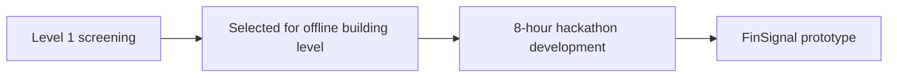
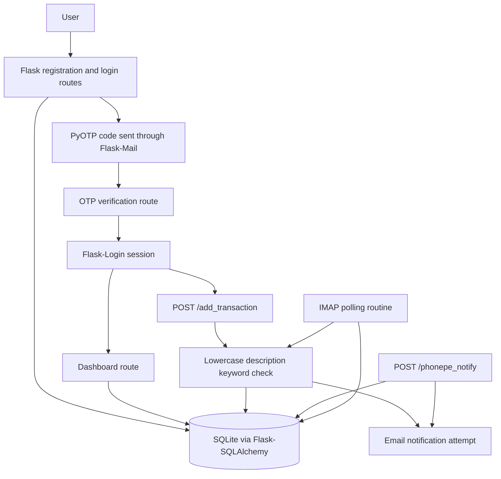
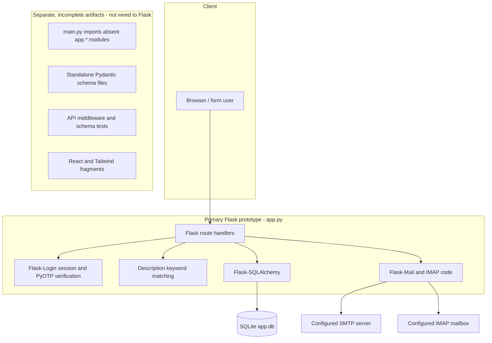
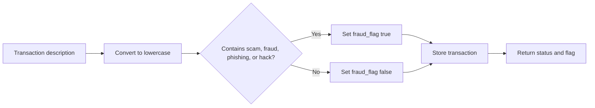

# FinSignal - FinTech Transaction Monitoring Prototype

**A hackathon prototype for recording transactions, flagging descriptions that contain selected suspicious terms, and sending email notifications.**


## Hackathon Information

| Attribute | Details |
|---|---|
| Hackathon | Vibeathon by Mind Mesh |
| Project | FinSignal |
| Team | MasterVibe |
| Track | Track 1 |
| Domain | FinTech |
| Venue | Vidyavardhaka College of Engineering, Mysore |
| Build duration | 8 Hours |
| GitHub organization | VectorFlow-vvce |

## Team Members

| Team Member | Role |
|---|---|
| Nisarga NS | Team Lead |
| Neha Anjum | Team Member |
| Neha BP | Team Member |
| Nikhitha | Team Member |

## Hackathon Journey



## Development Status

> "I will verify and develop full working protocol"

**Project stage:** Prototype; it was not fully developed during the hackathon.

## Development Tools

Kiro by AWS was used as a developer tool. Agents fully automated the prototype through prompts.

## Contents

- [Project Overview](#project-overview)
- [Development Tools](#development-tools)
- [Key Features](#key-features)
- [End-to-End Workflow](#end-to-end-workflow)
- [System Architecture](#system-architecture)
- [Technology Stack](#technology-stack)
- [Project Structure](#project-structure)
- [Authentication and Security](#authentication-and-security)
- [Fraud Detection Workflow](#fraud-detection-workflow)
- [Database and Data Flow](#database-and-data-flow)
- [Installation and Setup](#installation-and-setup)
- [Running the Application](#running-the-application)
- [API Overview](#api-overview)
- [Screenshots and Demo](#screenshots-and-demo)
- [Hackathon Build Context](#hackathon-build-context)
- [Limitations](#limitations)
- [Team](#team)
- [License](#license)

## Project Overview

`app.py` contains a Flask application configured to use SQLite through Flask-SQLAlchemy. It defines `User` and `Transaction` models, registration and login routes, TOTP verification using PyOTP, and email sending through Flask-Mail.

The `/add_transaction` route reads `amount` and `description` from JSON, calls `detect_fraud`, stores a transaction, attempts to send email, and returns JSON containing a status and fraud flag. `detect_fraud` checks the lowercased description for `scam`, `fraud`, `phishing`, or `hack`.

The `/phonepe_notify` route reads `email`, `amount`, and `description`, then attempts to record a transaction and send email for a matching account. The Flask source also defines an IMAP polling function that checks for transaction-related email and extracts an amount.

Other repository files contain Pydantic schema modules, a FastAPI entry point, middleware tests, and React/Tailwind fragments.

## Key Features

| Code path | What the source defines | Location |
|---|---|---|
| Registration | Reads email and password form values and adds a `User` record. | `/register` in `app.py`. |
| Login and TOTP | Compares submitted credentials and uses PyOTP to verify a code. | `/login`, `/two_factor`, and helper functions in `app.py`. |
| Transaction entry | Reads amount and description from JSON, calls `detect_fraud`, stores a `Transaction`, and returns JSON. | `POST /add_transaction` in `app.py`. |
| Description check | Lowercases text and checks for four configured substrings. | `detect_fraud` in `app.py`. |
| Transaction listing | Queries the current user's transactions in descending timestamp order. | Dashboard handler in `app.py`. |
| Email | Calls Flask-Mail for OTP and transaction-related messages. | `send_email` and its call sites in `app.py`. |
| PhonePe-labelled route | Reads email, amount, and description, then creates a transaction for a matching user. | `POST /phonepe_notify` in `app.py`. |
| IMAP polling | Searches unseen messages for “transaction” in the subject or body and calls the amount extractor. | `monitor_email_transactions` and `extract_amount` in `app.py`. |

## End-to-End Workflow

The diagram summarizes calls and data access declared in `app.py`; it does not indicate that the prototype was completed or verified end to end.



## System Architecture



The lower group lists other repository artifacts; the files shown do not form part of the Flask route flow in `app.py`.

## Technology Stack

### Logo Strip

The badges indicate technologies named in repository imports or configuration. Their presence does not imply a complete frontend or API application.


| Layer | Technology | Repository evidence / role |
|---|---|---|
| Primary backend | Python, Flask | Flask app and route handlers are in `app.py`. |
| Persistence | SQLite, Flask-SQLAlchemy | The Flask configuration selects a SQLite URI and defines `User` and `Transaction` models. |
| Authentication | Flask-Login, PyOTP, Flask-Mail | Session helpers, TOTP generation/verification, and email sending are defined in `app.py`. |
| Transaction flagging | Python keyword matching | `detect_fraud` checks four substrings and returns a boolean. |
| Additional schemas | Pydantic | `bank_details.py`, `transaction.py`, and `notification.py` define validation/schema classes. These are not connected to Flask routes here. |
| API scaffold | FastAPI, Starlette | `main.py` declares an app but imports `app.*` modules that are absent from the repository. |
| UI fragments | React, React Router, Tailwind CSS, Radix UI, Framer Motion, Lucide, Base44 SDK | Imports/configuration appear in loose JSX/JavaScript files. No package manifest or matching application source tree is present. |
| Tests | pytest | `test_schemes.py` contains Pydantic schema tests; `middleware.py` contains API middleware tests that depend on absent `app.*` modules. |

No package or dependency manifest is present in the repository.

## Project Structure

```text
track1_MasterVibe/
├── README.md
├── app.py
├── app_layout.jsx
├── bank_details.py
├── biometric_analysis       # WebAuthn pseudocode, not an executable module
├── components.js
├── dabase.py                # Imports app.models modules not present here
├── dashboard.html           # Standalone Flask demo source, despite the .html suffix
├── demo.js
├── demo2.jsx
├── layout.jsx
├── loginpage.html
├── main.py                  # FastAPI scaffold with unresolved app.* imports
├── middleware.py            # API middleware tests, not middleware implementation
├── notification.py
├── stack.jsx
├── test_schemes.py
├── transaction.jsx
├── transaction.py
├── ui_design.js
└── ux.json                  # Tailwind configuration content
```

| File | Purpose |
|---|---|
| `app.py` | Primary Flask prototype, SQLite models, auth, transaction handlers, keyword check, mail and IMAP code. |
| `dashboard.html`, `loginpage.html` | Standalone HTML/Python demo material; `dashboard.html` is Python code, not an HTML template. |
| `bank_details.py`, `transaction.py`, `notification.py` | Standalone Pydantic schemas. |
| `test_schemes.py` | Tests for schema types imported from an `app.schemas` package that is absent from this checkout. |
| `main.py`, `middleware.py`, `dabase.py` | FastAPI/API scaffold and related tests/model imports; required `app.*` modules are not included. |
| `app_layout.jsx`, `layout.jsx`, `components.js`, `demo2.jsx`, `stack.jsx`, `transaction.jsx`, `demo.js`, `ui_design.js`, `ux.json` | Disconnected UI/configuration fragments; their referenced frontend modules and package manifest are absent. |
| `biometric_analysis` | Plain-text algorithmic pseudocode for biometric registration, not an implemented biometric feature. |

## Authentication and Security

The Flask source contains:

- Flask-Login is used to establish and check a signed-in session on selected routes.
- PyOTP creates a TOTP secret per registered account and verifies submitted codes.
- Flask-Mail is used to send the TOTP and transaction messages when configured.
- The dashboard, transaction-entry, bank-details update, guide, tutorial, and logout handlers are decorated with `login_required` in the primary Flask declarations.

The Flask source also contains:

- The Flask registration path stores the submitted password directly and login compares it directly; password hashing is not implemented.
- Flask's `SECRET_KEY` and mail settings are assigned in source as example values/placeholders rather than read from environment configuration. No actual credential values are reproduced here.
- `POST /phonepe_notify` does not require login and does not validate a webhook signature in the Flask implementation.
- The FastAPI JWT/authentication material is not an implemented control in this checkout: the referenced `app.middleware` and `app.config` modules are absent. `middleware.py` is test code that expects those modules.
- The `biometric_analysis` file is pseudocode; no biometric verification implementation is present.

## Fraud Detection Workflow

The `detect_fraud` function receives a description, converts it to lowercase, and checks for `scam`, `fraud`, `phishing`, or `hack`. It returns `True` when a term is found and `False` otherwise. The `/add_transaction` route stores the returned value in `Transaction.fraud_flag` and includes it in its JSON response.



This function checks those four substrings and returns a boolean; it does not calculate a numeric score.

## Database and Data Flow

The Flask app configures SQLite through Flask-SQLAlchemy. Its script entry point calls `db.create_all()` in the application context. No database file is present in the repository.

| Model | Fields represented in the Flask source | Flow |
|---|---|---|
| `User` | Integer ID, email, password, OTP secret, PhonePe-notification preference, bank-details text | Registration writes a user; login and OTP verification read it; bank-details update modifies it. |
| `Transaction` | Integer ID, user ID, amount, description, timestamp, fraud flag | Manual entry and the PhonePe-labelled path write transaction rows; dashboard queries the current user's rows by descending timestamp. |

`Transaction.user_id` is declared as a foreign key to `user.id`. The Pydantic schema files are separate from these Flask-SQLAlchemy model declarations.

## Installation and Setup

The repository does not include `requirements.txt`, `pyproject.toml`, a lockfile, `package.json`, or an environment example. Dependency versions are not specified.

`app.py` imports Flask, Flask-SQLAlchemy, Flask-Login, Flask-Mail, and PyOTP. Other source files import Pydantic and JavaScript UI packages.

The Flask app assigns its secret and mail settings directly in `app.py`; environment-variable configuration is not present in the repository. Secret and mail values are intentionally omitted here.

## Running the Application

`app.py` contains a script entry point that creates the Flask database tables and calls `app.run(debug=True)`. The corresponding source-level command is:

```bash
python app.py
```

The app's successful startup and page behavior have not been verified. The source contains duplicate route declarations and refers to template files that are not present in the repository.

`main.py` contains a Uvicorn command in its docstring and imports `app.*` modules that are not present in the repository.

## API Overview

The table lists route declarations in `app.py`. Several paths are registered more than once in that file. This section records source declarations; it does not assert that every route runs successfully.

| Method | Path | Declared behavior |
|---|---|---|
| `GET` | `/` | Redirects to the dashboard for an authenticated user, otherwise to login. |
| `GET`, `POST` | `/register` | Registration form and account creation. |
| `GET`, `POST` | `/login` | Login form; successful password check starts the OTP step. |
| `GET`, `POST` | `/two_factor` | Presents and verifies the TOTP step. |
| `GET` | `/dashboard` | Loads the current user's transactions and bank-details text. |
| `POST` | `/add_transaction` | Reads JSON transaction fields, stores a keyword flag, attempts email, and returns JSON. |
| `POST` | `/update_bank_details` | Reads the `bank_details` form field and saves it for the current user. |
| `GET` | `/user_guide`, `/tutorials` | Protected guide/tutorial page handlers. |
| `GET` | `/logout` | Ends the Flask-Login session. |
| `POST` | `/phonepe_notify` | Reads `email`, `amount`, and `description`; records for a matching user and sends an email. No signature verification is implemented. |

`main.py` imports API routers from modules that are not present in the repository. The Flask routes listed above use non-`/api` paths.

## Screenshots and Demo

No screenshot or demo image files are present in the repository.

### Application Interface

<!-- Add an application screenshot when a verified running interface is available. -->

### Transaction Flag Result

<!-- Add a screenshot of an actual transaction result when available. -->

## Hackathon Build Context

MasterVibe was selected through Level 1 screening and nominated to the offline building level. The team developed the FinSignal prototype during the 8-hour Track 1 FinTech build phase at Vidyavardhaka College of Engineering, Mysore, as part of Vibeathon by Mind Mesh. This was the team's first hackathon.

## Limitations

- The repository has no dependency manifests, lockfiles, frontend package manifest, or environment example.
- The primary Flask application has duplicate URL rules and refers to template names under a templates directory that is absent from the repository.
- `main.py`, `dabase.py`, and the middleware tests refer to an `app.*` package tree that is not present. Therefore, the FastAPI/API scaffolding cannot be verified as a runnable service here.
- The React/Tailwind files are loose fragments with unresolved imports and no build setup; they are not demonstrated as the frontend for the Flask app.
- The fraud check in `app.py` is a four-keyword substring rule that returns a boolean.
- Passwords are stored without hashing in the Flask implementation. Configuration is hard-coded, the app enables Flask debug mode in its script entry point, and the PhonePe-labelled endpoint has no webhook signature validation.
- Email/IMAP behavior depends on external account configuration that is not supplied or safely externalized in the repository.
- No license file, screenshots, deployed endpoint, or verified deployment instructions are included.

## Team

**MasterVibe**

| Member | Role |
|---|---|
| Nisarga NS | Team Lead |
| Neha Anjum | Team Member |
| Neha BP | Team Member |
| Nikhitha | Team Member |

GitHub organization: **VectorFlow-vvce**. No individual profile links or repository URL are specified here.

## License

No explicit license has been included in the repository.
